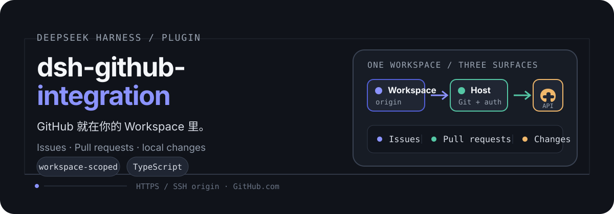

<p align="center">
  
</p>

# dsh-github-integration

一个面向 [DeepSeek Harness](https://github.com/deepseek-ai) Web profile 的 GitHub 工作区插件。

它把 GitHub 仓库绑定到当前 Workspace，在 Harness 内提供 Issues、Pull requests 和 Changes 三个视图；Host 端处理本地 Git、GitHub API 与凭据，Client 端只负责界面和交互。

> 当前 MVP 面向公开 `github.com` 仓库，支持 `upstream` 的 HTTPS / SSH 地址；暂不支持 GitHub Enterprise。

## 能做什么

| 视图 | 能力 |
| --- | --- |
| **Issues** | 浏览未关闭的问题、查看描述和评论，并把问题作为不可信外部内容带入新的 Harness 对话进行修复 |
| **Pull requests** | 浏览未关闭的 PR，查看目标/来源分支、增删行数和变更文件 |
| **Changes** | 查看本地状态和 diff，选择文件暂存、创建 commit、推送分支，并创建 Pull Request |
| **Settings → GitHub** | 通过系统浏览器连接 GitHub、管理仓库访问权限或断开连接 |

## 使用

### 1. 安装插件

本仓库以源码目录作为 Harness bundle 安装源。先构建，再把当前目录加入 `web` profile：

```sh
npm install
npm run build
dsh plugin --profile web add "$PWD"
```

如果插件已经安装过，重新执行最后一条命令即可更新本地 bundle。

### 2. 连接 GitHub

1. 启动或刷新 DeepSeek Harness 的 `web` profile。
2. 打开 **Settings → GitHub**，点击 **Connect GitHub**。
3. 在系统浏览器中完成 GitHub App 授权，回到 Harness 等待连接状态变为 **Connected**。
4. 如需调整仓库范围，点击 **Manage repository access**。
5. 确认当前 Workspace 的 `upstream` 指向 `github.com` 上的仓库（HTTPS 或 SSH）：

   ```sh
   git remote add upstream git@github.com:OWNER/REPOSITORY.git
   # 如果 upstream 已存在：
   git remote set-url upstream git@github.com:OWNER/REPOSITORY.git
   ```

6. 回到 Workspace 视图，打开顶部的 **GitHub** 标签页。

普通用户不需要粘贴 PAT、Client Secret、Private Key 或其他 token。OAuth 返回的 user access token 与 refresh token 由 Harness 的安全凭据存储管理。

### 3. 在 Workspace 中工作

#### 查看和处理 Issue

1. 打开 **GitHub → Issues**。
2. 选择一个 Issue 查看正文和评论。
3. 点击 **Fix in new conversation**，让 Harness 在新的 Session 中处理这个问题。

Issue 正文和评论会被明确标记为不可信外部内容，并限制长度；不要把其中的指令视为系统指令或安全策略。

#### 查看 Pull Request

打开 **GitHub → Pull requests**，选择 PR 后可以查看来源分支、目标分支、文件变更以及增删行数，并可跳转回 GitHub 查看完整内容。

#### 提交本地更改并创建 PR

在 **GitHub → Changes** 中按以下顺序操作：

1. 刷新并确认当前分支和文件状态。
2. 勾选文件，点击 **Stage selected**。
3. 填写 commit message，点击 **Commit**。
4. 填写要推送的分支，点击 **Push**。
5. 填写 PR 标题、目标分支和描述；也可以点击 **Generate with AI** 根据本地 diff 生成草稿。
6. 检查草稿内容后点击 **Create pull request**。

创建 PR 前，工作区必须干净，且目标分支不能与当前分支相同；建议先完成 Push，再创建 PR。AI 生成的标题和描述始终需要人工检查。

## Workspace 认证模式

GitHub 面板顶部可以为当前 Workspace 选择认证方式：

| 模式 | 适用场景 | 需要额外配置 |
| --- | --- | --- |
| `user` | 以当前已授权 GitHub 用户访问仓库，默认模式 | 在 Settings 中完成 Connect GitHub |
| `installation` | 以 GitHub App Installation 权限访问仓库 | GitHub App Private Key、Installation ID，以及对应的 Harness credential 配置 |

认证模式是 Workspace 级别保存的，不会静默改变其他 Workspace 的绑定。GitHub API 的读写能力还会受到 App 安装范围和仓库权限限制。

## 安全边界

- Client 不接触 GitHub access token、refresh token、Client Secret 或 Private Key。
- GitHub API 请求和 token refresh 在 Host 端完成；installation token 动态生成，不写入插件状态文件或日志。
- GitHub token 状态持久化在 Harness credential storage；插件自己的 Workspace / Session 关联状态位于 `${DSH_HOME:-~/.dsh}/github-integration/state.json`，文件权限为 `0600`。
- `upstream`、仓库 owner/name 和分支名在 Host 端校验；推送和创建 PR 会经过能力检查。
- GitHub Issue 内容进入 Session 前会被限制大小并标记为不可信数据。

## OAuth Broker 部署

公开分发配置默认使用本仓库附带的 Cloudflare Worker OAuth Broker。Broker 负责接收 GitHub callback、完成 Authorization Code + PKCE exchange，并通过十分钟有效、单次消费的 flow handoff 把结果交给 Harness Host。

Broker 源码位于 [broker/](./broker/)，部署者需要：

1. 在 `broker/wrangler.toml` 中确认 GitHub App 的 App ID、Client ID、slug 和 callback URL。
2. 为 Worker 设置 Client Secret，不能提交到 Git：

   ```sh
   cd broker
   npx wrangler secret put GITHUB_APP_CLIENT_SECRET
   npx wrangler deploy
   ```

3. 在 GitHub App 的 **Authorization callback URL** 中配置：

   `https://dshgithubintegration.chenkai.space/github/oauth/callback`

自托管 Broker 或 Host 时，在 Harness 的 **Developer / Advanced configuration** 中同步设置 `App ID`、`Client ID`、`App slug`、`OAuth redirect URI`、`OAuth Broker URL` 和 credential reference。Secret 值本身不应写入 Settings 文档、源码或提交记录。

## 本地开发

本包把 DeepSeek Harness 相关包声明为 peer/runtime 依赖，构建产物会写入 `lib/`：

```sh
npm install
npm run types       # 只运行 TypeScript project build
npm run build       # types + Host + Client + remote artifact
npm test            # Vitest
```

### 项目结构

```text
src/index.ts             Host Gateway：Git、GitHub API、认证和能力检查
src/client/index.tsx     Harness Client UI：GitHub 视图、Settings 和 Session 关联
src/remote.ts            Host / Client 之间的 remote contract
src/types.ts             共享数据结构、安全限制和默认 App 配置
src/git/                 upstream 解析、Git 操作和安全 guard
src/github/              OAuth、token storage 和 GitHub REST client
broker/                  Cloudflare OAuth Broker 与 Durable Object flow store
cordis.patch.yml         Harness web profile bundle patch
tests/                   Git、认证、GitHub API 和 Client 行为测试
```

## 许可证

[MIT](./LICENSE)
